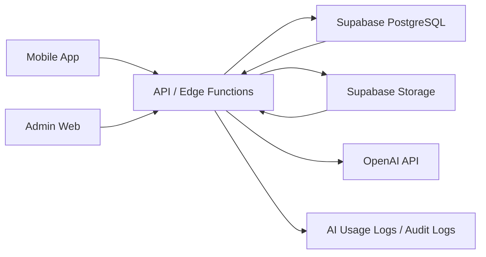

# Architecture

## 1. Monorepo 結構

建議採用規格要求的 monorepo，讓 mobile、admin、api 與共用契約同版控管：

```text
apps/
  mobile/              # Expo + React Native + Expo Router
  admin/               # Next.js 管理後台
  api/                 # Node.js API 或 Supabase Edge Functions 共用入口
packages/
  shared-types/        # 跨 app 使用的 TypeScript domain types
  validation/          # Zod schemas 與 request/response contracts
  ui/                  # 跨平台 UI primitives，避免業務邏輯
  grading/             # 固定題型評分與答案正規化
  learning-engine/     # 掌握度與複習排程
  ai-schemas/          # AI JSON Schema 與解析器
  ai-prompts/          # 版本化 prompt，不散落在程式碼中
  database/            # typed DB helpers、repository interfaces
  config/              # ESLint、TSConfig、Prettier、Jest 共用設定
supabase/
  migrations/
  seed/
  functions/
docs/
tests/
```

目前 Phase 0 只建立骨架與文件，不建立大量 App 頁面。

## 2. 技術選型

| 層級    | 技術                                                                                       |
| ------- | ------------------------------------------------------------------------------------------ |
| Mobile  | React Native, Expo, TypeScript, Expo Router, React Hook Form, Zod, TanStack Query, Zustand |
| Admin   | Next.js, TypeScript, React, Supabase, Zod, TanStack Query                                  |
| Backend | Supabase PostgreSQL, Supabase Auth, Supabase Storage, RLS, Edge Functions 或 Node.js API   |
| AI      | OpenAI Responses API, Structured Outputs, JSON Schema, Speech-to-Text, Text-to-Speech      |
| Testing | Jest, React Native Testing Library, integration tests, Maestro 或 Detox                    |

TypeScript strict mode 必須啟用。UI 元件不得直接呼叫資料庫；資料存取需透過 repository、query hook 或 API client。

## 3. 邊界

### Mobile App

- 負責 UI、離線快取、表單驗證、狀態呈現與 API 呼叫。
- 不保存 OpenAI API key 或 Supabase service role key。
- 不直接查詢資料庫。
- 固定題型可先本地預覽，但後端會以受信任內容重新評分，最終 Attempt 只採後端結果。

### Admin Web

- 負責內容建立、審核、發布、版本、音訊與統計管理。
- 管理頁面必須通過 role 檢查。
- AI 生成草稿只能建立 draft 或 pending_review。

### Backend

- 負責 Auth、RLS、課程查詢、attempt、progress、review queue、AI 呼叫、音訊服務、成本紀錄、rate limit、audit log。
- 所有 AI 回傳需通過 JSON Schema、Zod、CEFR、禁止內容與完整性檢查。

## 4. 資料流



固定題型流程：

1. Mobile 載入 lesson 與 exercises。
2. 使用者作答。
3. grading package 先產生本地結果。
4. Mobile 只送出原始答案、時間、提示使用狀態與 idempotency key。
5. Backend 載入已發布題目、重新評分並以 transaction 寫入 attempt、error_records、skill_mastery、review_queue。

AI 題型流程：

1. Mobile 送出自由回答或作文。
2. Backend 建立 idempotency key 與 rate limit 檢查。
3. Backend 呼叫 OpenAI Responses API。
4. Backend 執行 JSON Schema、Zod、CEFR、安全與完整性驗證。
5. Backend 寫入 ai_feedback、ai_usage_logs、error_records、review_queue。
6. Mobile 顯示繁體中文回饋與 retry/fallback 狀態。

## 5. API 契約

所有 API 需定義 request schema、response schema、權限、錯誤碼、rate limit、cache、idempotency。

| Method | Path                               | Request Schema                       | Response Schema                   | 權限                    | Rate limit         | Cache            | Idempotency |
| ------ | ---------------------------------- | ------------------------------------ | --------------------------------- | ----------------------- | ------------------ | ---------------- | ----------- |
| GET    | /courses                           | CourseListRequest                    | CourseListResponse                | public published        | 120/min            | yes              | no          |
| GET    | /courses/:courseId                 | CourseDetailRequest                  | CourseDetailResponse              | public published        | 120/min            | yes              | no          |
| GET    | /lessons/:lessonId                 | LessonDetailRequest                  | LessonDetailResponse              | public published        | 120/min            | yes              | no          |
| GET    | /vocabulary                        | VocabularyListRequest                | VocabularyListResponse            | public published        | 120/min            | yes              | no          |
| GET    | /vocabulary/:itemId                | path UUID                            | VocabularyDetailResponse          | public published        | 120/min            | yes              | no          |
| GET    | /grammar-topics                    | GrammarTopicListRequest              | GrammarTopicListResponse          | public published        | 120/min            | yes              | no          |
| GET    | /grammar-topics/:topicId           | path UUID                            | GrammarTopicDetailResponse        | public published        | 120/min            | yes              | no          |
| POST   | /attempts                          | SubmitAttemptRequest                 | SubmitAttemptResponse             | learner self            | 60/min             | no               | yes         |
| GET    | /users/me/progress                 | ProgressRequest                      | ProgressResponse                  | learner self            | 60/min             | no               | no          |
| GET    | /users/me/reviews                  | ReviewQueueRequest                   | ReviewQueueResponse               | learner self            | 60/min             | no               | no          |
| POST   | /reviews/:reviewId/complete        | CompleteReviewRequest                | CompleteReviewResponse            | learner self            | 60/min             | no               | yes         |
| GET    | /users/me/settings                 | none                                 | UserSettingsResponse              | learner self            | 60/min             | no               | no          |
| PUT    | /users/me/onboarding               | OnboardingRequest                    | UserSettingsResponse              | learner self            | 60/min             | no               | no          |
| PUT    | /users/me/notification-preferences | UpdateNotificationPreferencesRequest | NotificationPreferencesResponse   | learner self            | 60/min             | no               | no          |
| GET    | /users/me/writing                  | none                                 | WritingWorkspaceResponse          | learner self            | 60/min             | no               | no          |
| DELETE | /writing/submissions/:id           | path UUID                            | DeleteWritingSubmissionResponse   | learner self            | 60/min             | no               | no          |
| POST   | /ai/evaluate-response              | EvaluateResponseRequest              | EvaluateResponseResponse          | learner self            | 20/rolling 24h     | learner scoped   | yes         |
| POST   | /ai/evaluate-writing               | EvaluateWritingRequest               | EvaluateWritingResponse           | learner self            | 10/day free tier   | no               | yes         |
| POST   | /admin/ai/exercise-drafts          | GenerateExerciseDraftRequest         | GenerateExerciseDraftResponse     | content_editor or admin | 20/rolling 24h     | replay only      | yes         |
| GET    | /users/me/audio-learning           | none                                 | AudioLearningWorkspaceResponse    | learner self            | 60/min             | no               | no          |
| POST   | /listening/activity                | ListeningActivityRequest             | ListeningActivityResponse         | learner self            | 60/min             | no               | no          |
| POST   | /listening/reveal-transcript       | RevealListeningTranscriptRequest     | RevealListeningTranscriptResponse | learner self            | 60/min             | no               | no          |
| POST   | /listening/submit-dictation        | SubmitDictationRequest               | SubmitDictationResponse           | learner self            | 60/min             | no               | yes         |
| POST   | /audio/text-to-speech              | TextToSpeechRequest                  | TextToSpeechResponse              | learner self or editor  | 60/day free tier   | yes by text hash | yes         |
| POST   | /audio/transcribe                  | TranscribeRequest                    | TranscribeResponse                | learner self            | 30/day free tier   | no               | yes         |
| DELETE | /speaking/submissions/:id          | path UUID                            | DeleteSpeakingSubmissionResponse  | learner self            | 60/min             | no               | no          |
| POST   | /conversations                     | CreateConversationRequest            | CreateConversationResponse        | learner self            | 20/day free tier   | no               | yes         |
| POST   | /conversations/:id/messages        | SendConversationMessageRequest       | SendConversationMessageResponse   | learner self            | scenario max turns | no               | yes         |

統一錯誤格式：

```json
{
  "error": {
    "code": "AI_RESPONSE_INVALID",
    "message": "無法解析 AI 回應。",
    "retryable": true,
    "requestId": "req_..."
  }
}
```

錯誤碼至少包含 VALIDATION_ERROR、UNAUTHORIZED、FORBIDDEN、NOT_FOUND、RATE_LIMITED、NETWORK_ERROR、DATABASE_ERROR、AI_TIMEOUT、AI_RESPONSE_INVALID、AUDIO_UPLOAD_FAILED、CONTENT_NOT_PUBLISHED。

## 6. 離線與同步

第一版支援：

- 已下載課程離線閱讀。
- 固定題型離線作答。
- 本地保存 pending attempts。
- 連線恢復後以 idempotency key 同步。

離線不支援 AI 批改、AI 對話、STT、即時題目生成。同步需避免重複 attempt，並保留衝突狀態供重試。

Phase 12 實作採用每位 profile 隔離的版本化 AsyncStorage snapshot。課程目錄規模目前受控，pending attempt 上限為 200 筆；每次讀取均重新通過 Zod 驗證，重啟時把中斷的 `syncing` 恢復為 `pending`。當單一 profile 的下載內容接近 5 MB、需要跨資料查詢，或待同步量超出此上限時，應遷移至 SQLite，而不擴大單一 JSON item。

固定題在裝置上立即評分並保存本機進度；同步佇列依原始 `submittedAt` 由舊到新呼叫同一個 server-authoritative `POST /attempts`。API 重新載入已發布題目與答案後評分，service-only RPC 保存原始作答時間並以該時間安排複習。回補限最近 30 天，未來誤差最多 5 分鐘；`400/404/409` 保留為 conflict，網路、rate limit 與登入錯誤保留為 failed，使用者可重試或明確捨棄。

## 7. 狀態與資料存取

- TanStack Query 管理 server state、loading、empty、error、retry。
- Zustand 管理 session-adjacent UI state，例如 onboarding progress、theme、download queue。
- React Hook Form + Zod 管理表單。
- API client 只呼叫 backend；不得直接從 UI 呼叫 Supabase table。
- DB row type、API DTO、UI ViewModel 分離。
- Phase 9 已將課程、固定作答、進度與複習移至 API；Phase 10 再將作文／音訊結構化資料與遙測移至 API；Phase 11 將 profile、onboarding 與通知偏好移至 API；Phase 12 在不繞過 API 權威評分的前提下加入下載與重連同步；Phase 13 將單字與文法知識庫改由 published-only typed API 提供。
- Mobile 的 Supabase client 僅保留 Auth 與 owner-scoped Storage binary 操作；Storage 路徑仍受 JWT 與 RLS 限制。

### 通知排程

- API 保存 master switch、各通知類型、提醒時間、未學習天數與 IANA timezone。
- Mobile 以 Expo Notifications 排程未來 14 次本機提醒；同一時區日期最多一筆排程提醒，未學習優先於到期複習，複習優先於一般每日提醒。
- 作文完成、新課程與每日目標使用本機事件 ledger 去重；點擊通知以 Expo Router deep link 返回對應工作區。
- Web runtime 明確降級為 no-op。遠端 push token、推播 outbox 與背景 dispatch 不屬於 Phase 11。

## 8. 環境設定

預期環境變數：

- EXPO_PUBLIC_API_BASE_URL
- EXPO_PUBLIC_SUPABASE_URL
- EXPO_PUBLIC_SUPABASE_ANON_KEY
- SUPABASE_SERVICE_ROLE_KEY
- OPENAI_API_KEY
- OPENAI_EVALUATION_MODEL
- OPENAI_TIMEOUT_MS
- OPENAI_INPUT_COST_PER_MILLION
- OPENAI_OUTPUT_COST_PER_MILLION
- AI_DAILY_FREE_LIMIT
- AI_EVALUATION_FAKE_MODE (local verification only)
- STORAGE_AUDIO_BUCKET
- APP_ENV

只有 public-safe 變數可進入 mobile bundle。service role key 與 OpenAI key 僅存在 backend runtime。

## 9. 主要 TypeScript 模型

`packages/shared-types` 至少建立下列 domain model，不得直接把資料庫 row 型別當作 UI ViewModel：

- UserProfile
- UserPreferences
- Course
- Unit
- Lesson
- Activity
- Skill
- GrammarTopic
- VocabularyItem
- Exercise
- ExerciseOption
- ExerciseAnswer
- Attempt
- AttemptAnswer
- ErrorRecord
- SkillMastery
- ReviewItem
- WritingSubmission
- AIFeedback
- ConversationScenario
- ConversationSession
- ListeningAsset
- ListeningAttempt
- SpeakingPrompt
- SpeakingSubmission
- AudioAsset
- ContentVersion

`packages/validation` 至少建立每個 API 的 request 與 response Zod Schema。命名採 `<Operation>RequestSchema`、`<Operation>ResponseSchema`，對應 TypeScript 型別 `<Operation>Request`、`<Operation>Response`。
